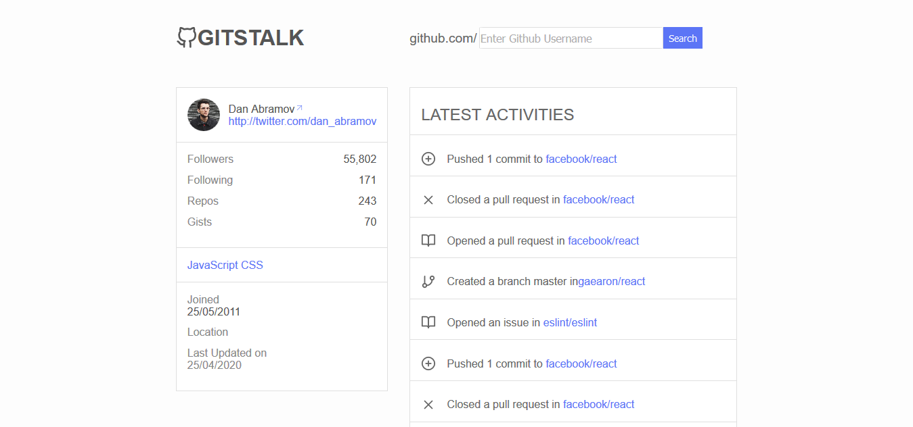

# Gitstalk

Discover who's up to what on Github!
Project that uses React Router for navigation, Formik that handles form and Yup for form validation.

Visit [Gitstalk](http://mygitstalk.surge.sh/)

## License

This project is licensed under the MIT License - see the [LICENSE](LICENSE) file for details.
